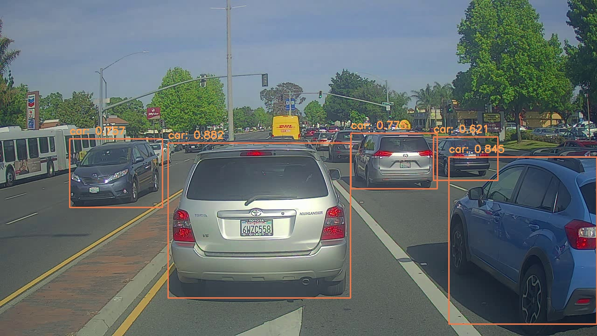
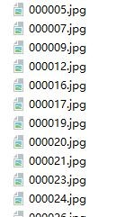
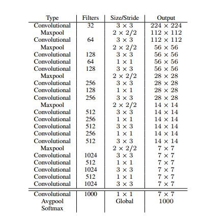

## YOLO2-Tensorflow

详细的内容见`yolo2_detect.ipynb`

1	数据集的准备： ① 索引文件trainval.txt: 存放的是训练图片的名称
                  
                 
                  ② 图片文件：
                  
                 ③ 标签文件xml:
                  

2	网络的设计（分类训练与检测训练）

   
   
   Training for classification: 在上图所示的网络中，先在标准ImageNet 1000 class分类数据集上做160 epochs的预训练，此时网络输入大小为(224 * 224), 然后调整输入图片的大小，变成 (448 * 448), 再用这个分类网络在ImageNet进行fine-tuning, 论文中是这样描述的：（We train the network on the standard ImageNet 1000 class classification dataset for 160 epochs using stochastic gradient descent with a starting learning rate of 0:1, polynomial rate decay with a power of 4, weight decay of 0:0005 and momentum of 0:9 using the Darknet neural network framework [13]. During training we use standard data augmentation tricks including random crops, rotations, and hue, saturation, and exposure shifts. As discussed above, after our initial training on images at 224 × 224 we fine tune our network at a larger size, 448. For this fine tuning we train with the above parameters but for only 10 epochs and starting at a learning rate of 10-3. At this higher resolution our network achieves a top-1 accuracy of 76:5% and a top-5 accuracy of 93:3%.）

   Training for detection: 修改上述网络，即移除上述网络中的最后一层，然后在后面添加3层卷积数量为1024，大小为3*3的卷积层（在这里的第二个卷积层后面会有细粒度特征的处理，然后将不同大小的特征连接到第三层卷积核，具体看源码），最后再放置一个卷积层，这个最后的卷积层其卷积核的数量为B*（5+num_class）,源码中是5*（5+80）= 425，可根据需要自行调整， 卷积核大小为1*1， 步长为1， 输出大小为13*13。在检测数据集上进行训练。论文中是这样描述的：（We modify this network for detection by removing the last convolutional layer and instead
adding on three 3 × 3 convolutional layers with 1024 filters each followed by a final 1 × 1 convolutional layer with the number of outputs we need for detection. For VOC we predict 5 boxes with 5 coordinates each and 20 classes per box so 125 filters. We also add a passthrough layer from the final 3 × 3 × 512 layer to the second to last convolutional layer so that our model can use fine grain features. We train the network for 160 epochs with a starting learning rate of 10-3, dividing it by 10 at 60 and 90 epochs. We use a weight decay of 0:0005 and momentum of 0:9. We use a similar data augmentation to YOLO and SSD with random crops, color shifting, etc. We use the same training strategy on COCO and VOC）

3	测试阶段：

注意处理网络的输出要和训练阶段一一对应。得到网络的输出之后，要经过几步处理。
① 将网络的输出分割成类别概率，置信度，框的位置值几个字段。
② 将类别概率与置信度一一对应相乘，得到类别置信度。
③ 进行第一步筛选，类别置信度小于设定阈值的框去掉。
④ 因为每个cell只负责预测一个类别，因此如果一个cell有两个框其类别置信度都超过了指定阈值，那么去类别置信度最大的那个框所预测出来的类别作为这个cell所预测的类别（特别注意这点）
⑤ 最后运用非极大值算法进行过滤，得出最后的结果。
